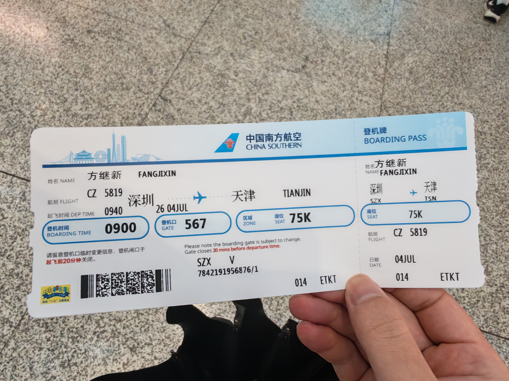
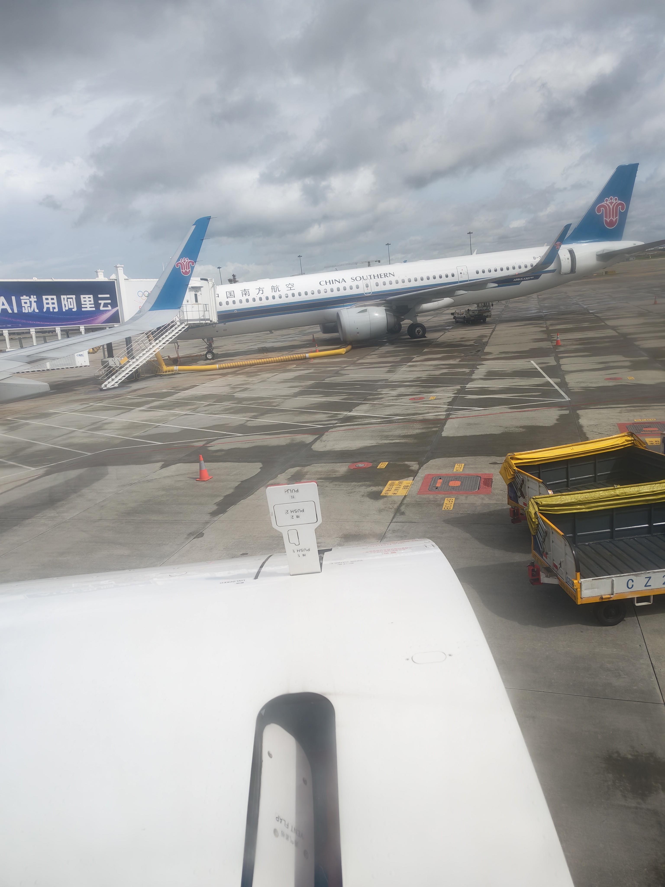
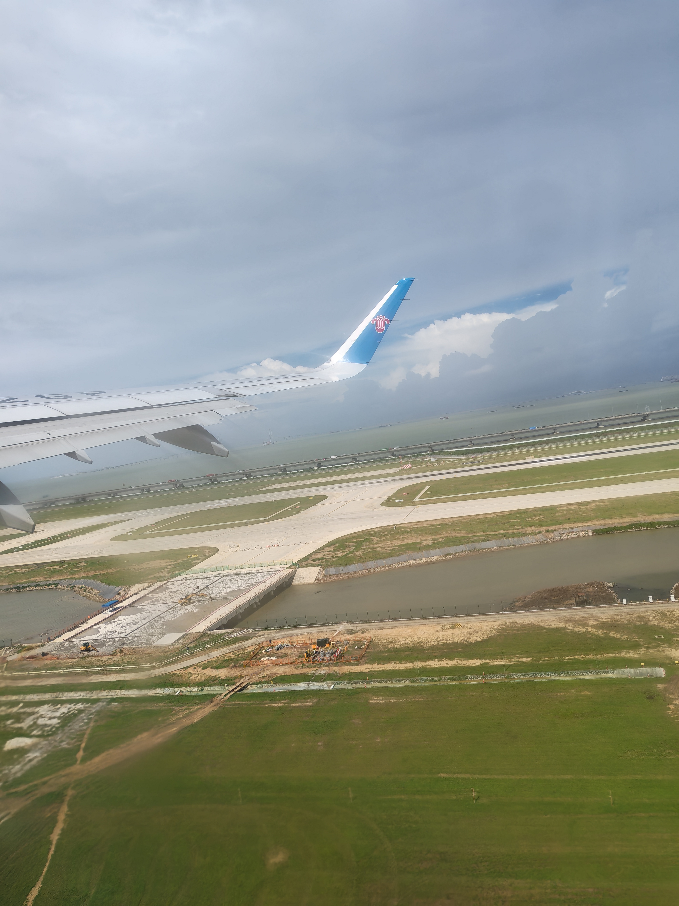
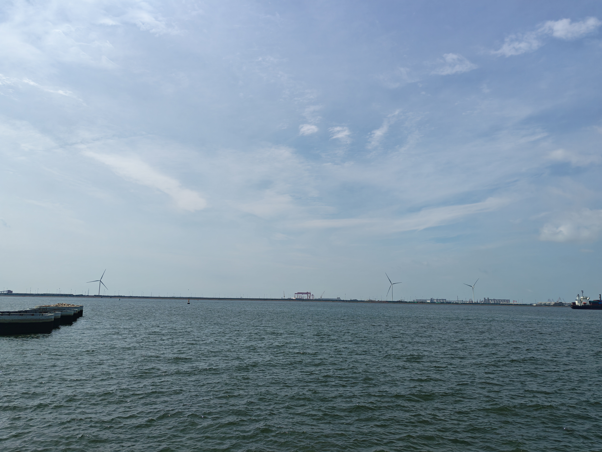
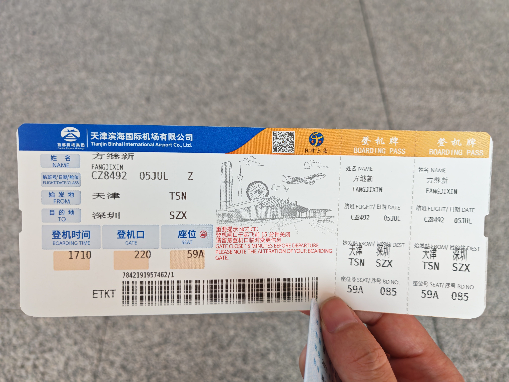
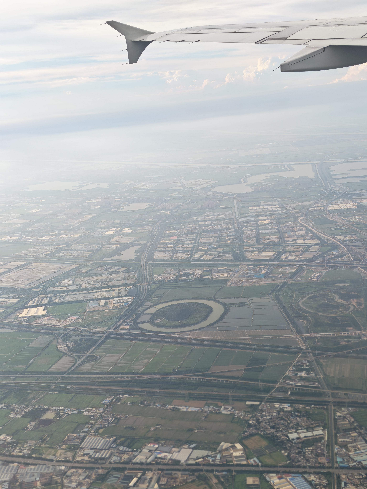
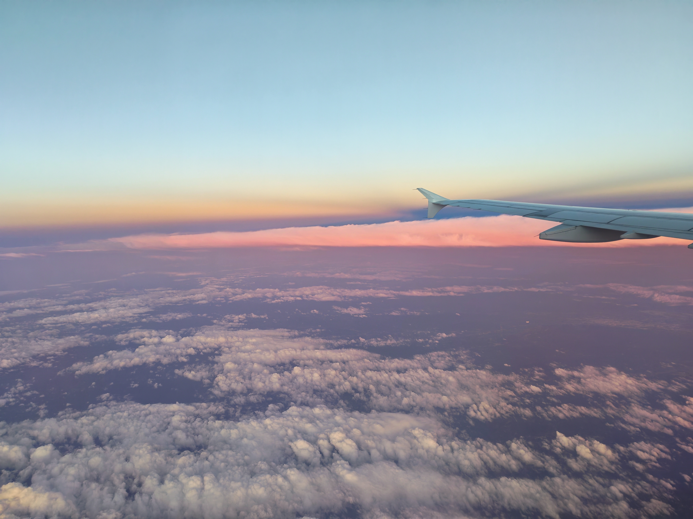

落笔2026-07-04

整理2026-07-06/07

## 2026-07-04

### 06:51

又在幻想着我们能够再相遇了。

我知道自己不应该每天沉浸在悲观的情绪当中，可是目前我还做不到。

我看去机场要一个半小时，到机场九点钟，然后再到候车厅又要二十分钟，九点四十的飞机，我为什么感到一种焦虑呢，这么害怕错过吗

我又想起了你说的人在的时候不好好珍惜，现在来求别拉黑能怪谁呢。好痛苦。

我又在想，为什么没有跟你说与你见面呢，是我的内心一直认为你还没有准备好与我见面，我便一直没有再提起。直到后来关系更不好的时候，我更是自以为你不想与我联系。现在回头看，我犯了一个很严重的偏见、自以为是的错误。我把我以为我觉得当成了我相信，宁愿一个人猜测，也不愿意多问你一句，我有这么害怕听到你回答一句不想的答案吗。我想我应该早点说

你想见我吗？如果你愿意，我很想见见你。

为什么会这么想呢，我发现去你那边并不需要很多的时间和精力，只是需要一个我们都想要见面并开口的机会。我总把你的难过，生气和叹息当做你不想理我，还有一丝害怕见面的尴尬或者拒绝，我没看到你难过的背后，更需要我的关心和靠近。

我为什么幻想着你会回来，我思考良久，我所做所为让你整整难受了一年，而这一年里支撑你下来的是我们曾经的爱意，这一年里，我对你的好屈指可数，对你的不好却非常明显，当你的痛苦大于爱意的时候，爱意便会逐渐消耗，这就是你说的我们不可能复合，你也不想与我说话的真是原因吧，这一切都是我咎由自取，是我没有看见并面对你内心那么多那么多需要我的感受。

曾经，你满含爱意地认为我可以改变，其实并不是我认为的不回复你的消息，所以我不打游戏了，我怕遇到你的消息我没能第一时间回复。现在不断反思才渐渐明白更多的是没有能够看见你的情绪和感受病一起面对吧。

### 08:56

我坐在深圳机场567侯厅座位上，我想到了你说的，我可能记不住具体的话了：“你根本就不在乎啊”，“可不可以多在意我一点”，此刻，我好像终于感受到了你的委屈，你的痛苦，眼泪在眼睛里不断打转，喉咙堵的发紧，几乎喘不过气来。我想到我应该无比痛恨自己，但是我的心情更多的是悲伤和难过，想要哭泣。

### 09:19

我看到了行李托运，想到了你每次坐飞机的时候也是需要在前台办理托运然后下飞机后又要把行李拎出来吧。我记得你每次行李都很多呢，行李箱也很大，一个人到那么远的地方，等到了要花一整天的时间，一定会很累吧。我想我应该对你的远行给予更多的关心。对啊，之前我会搜索关于你火车的行程和时间，会询问你是否需要我提醒你下车，我会定一个闹钟。只是那样的时刻，我没有坚持下来，偶尔询问一下什么时候出发，什么时候到达，不知道那时候你是什么感受，会不会感觉到失望。

回忆一下早上的时候，我一觉醒来就六点半了，昨晚觉得我应该也没有想要带的东西吧，一个本子一支笔然后一次换洗的衣服就够了。然而早上醒来的时候我发现我的背包还在办公室呢，还好我还有一个背包，等我出门后我又想到我没有带外套，又返回去拿，又发现外套也在办公室，但是我还有一件，还好。最近脑子总是慢半拍，丢三落四的。

### 13:00

还是这一家花店，是桔梗花。

### 15:01

我又来到了这棵柳树下，还是两朵桔梗。请帮助我承载一些思念与愧疚，谢谢。

蝉鸣声此起彼伏，内心不知道是烦躁还是宁静。

我喜欢这个地方。

好像什么都没变。柳树还在，风也还在。

为什么我会想要沉浸在失去的痛苦之中

1、我只有愧疚思念和痛苦才能持续和这段过往连接

2、痛苦是我唯一的赎罪方式

3、我在逃避现实，不敢面对自己的缺陷

4、我无法接受因为自己的悔恨当初而失去她的事实

我知道，人的情绪终究无法阻挡时间的洪流。再浓烈的悲伤，也会在日复一日中慢慢淡下来。

而我已经开始感觉到这种变化了。可是我有一点害怕。

我想起自己还天真地对你说：咕了吧，如果不管用还可以再回来。

现在回头看，才发现自己有多蠢。

我怎么敢和时间去赌呢？

## 2026-07-05

### 08:14

早上好啊，今天下雨了呢，前几天一时冲动，忘记查看天气了，看天气预报说今天要下很久的雨呢，淅淅沥沥。

走在广场的路上，四边只有车流声和雨声，早上基本都没有行人呢，店铺也都还没有开张，哇，我想找个早餐的第二，走了半个小时也碰不到。

观棠记，终于碰到了一家早餐店，点了一份豆腐脑，一份大饼。大意了，这个豆腐脑是胡辣汤豆腐脑吧，不好吃，大饼没有拿小菜，干巴巴的，不过把大饼放进豆腐脑泡两下还是能入口的。里面好热，还好今天下雨了，走出门口，真是凉爽极了，不知道你今天是否有准备出去玩呢，雨停的时候非常适合外出呢。

### 08:52

雨停了，一时间不知道该去往哪里呢。

### 10:34

我来到了海边，下去围栏，沿着海边不断行走，离中心越来越远

我的腿怎么又痛起来了，走太多路了。

### 11:22

想着想着我差点又冲动着要去找你了，我想到了你说的每次我一联系你你就会痛苦。

从海边坐公交到九号线，然后坐地铁，然后再走过去。

好困啊，昨晚上醒了好几次，每次醒来身上一身汗，也不知道是梦见了什么。

### 12:11

我还说从地铁站走过去，一出地铁站整条腿都废了，痛死我了。

早上还说下雨天空气清新凉爽呢，不一会现在中午又是烈阳当空了。

我又来到这棵柳树下，找个地方静静坐下。

我的话好像越来越少了。其实我也不知道说些什么，我只是想坐在这里，再待一会儿。

