落笔2026-06-05

整理2026-06-10

# 20260530 邮件

### 20260227 02:48

世界上最最最好的宝宝：

今天，我怀着无比沉重的心情写下这份检讨书。

一、事件经过

    2026年2月25日凌晨2点收到宝宝的消息醒来，宝宝说小猫奶糖丢失了，问我找不回来了怎么办，我想着怎么也得安慰一下，却说出了“猫猫很聪明，找不回来就当它可能被其他人收养有了新生活”的话。但紧接着就是宝宝的拉黑和分手通知，这让我猝不及防，我难受了一会儿，然而看到宝宝说出“我还在寻找你却就让我接受它去别人家”我才知道我说错话了。

二、本质原因

    第一是在奶糖走丢，宝宝明显焦虑难受的时候竟然说出如此令人伤心的话。

    第二是宝宝说她在意的其实是我每次保证说话要过过脑子但每次都再犯的问题，我说：“要是脑子这么好用就好了”，“我也希望我都能想明白啊”，这在宝宝看来是一副死猪不怕开水烫的态度，根本没有犯错了及时改正的态度和想要和好的想法在。所以我说下次一定说话前好好思考，这又回到了我的保证跟放屁一样，让宝宝很是失望。

三、反思

    首先跟宝宝说一声抱歉，真的很对不起宝宝，在明知奶糖对宝宝这么重要，宝宝一定很着急的情况下说出这么令人伤心和难过的话，我当时也是蠢得要死。

    回首不久前：在宝宝面前有说出过对宝宝而言不尊重她的话的事情；还有一段时间有些内耗的时候对宝宝发脾气的事情；还有因为宝宝出去玩回来后打游戏而责怪她却不自知的事情；这些事情发生的话语其实都有说话太过情绪化而不过脑子的情况导致宝宝生气了。宝宝说的对，情商低不是犯错的借口，情商低就在开口前花几秒时间站在宝宝的角度思考将要说出的话是否有不妥的情况，特别是在宝宝难受或者焦虑的时候，更应该体会宝宝的感受，而不是随口就说出一些误解甚至会造成伤害的话，这样宝宝不生气才怪呢。哪怕本意并非如此，但是要知道话语的伤害却是从口中出来了。

    宝宝在拉黑并提出分手的时候，我第一反应是我又让宝宝失望了，真要分开了吗。在宝宝说要么检讨要么分手的时候，我知道是宝宝在给我台阶下，我想既然我这么差劲，为什么还要紧抓着她不放呢，但是我就是不想失去宝宝呀，谢谢宝宝，我真的好喜欢你。

    另外，宝宝说的对，再犯决不能轻易原谅，没有惩罚不长记性，如果下次还是这么没有脑子，我自愿承受以下任意一项事情：

连续外卖投喂直至宝宝心情变好

罚款200-500

宝宝想要的礼物

宝宝想要我做的事情或物品（力所能及的全力办）

一脚踢开（还是希望宝宝脚下留情）

宝宝可以补充

检讨人：方某某

日期：2026年02月27日

### 20260530 02:03 回复：

嗨。

写下这封邮件时我删删改改，没办法文思泉涌。我想要告诉你的事情又多又乱。

这是我们认识的第三年，恋爱的第二年。

分手的原因很简单：你太沉默，而我太需要回应，以及，我不确定我是否还爱你。

如果你没有对我说过伤人的话，如果我们之间没有那次长时间的沉默，如果我没有那么任性，我们是不是不会走到现在？

我不知道。

我变得越来越歇斯底里，不可理喻。我知道我们之间到这里就结束是最好的，再继续就不大体面了。

上一次分手时，我怀着满心的失望告诉你我仍爱着你，期待你回心转意。这一次分手，我没有正常睡觉、正常上课，好像什么都没有发生。

第一次在课本里见到刻舟求剑，我说楚人好蠢，怎么会在现在找过去的事物呢？现在看来，我也是蠢人。我在记忆里刻舟求剑，求什么呢？你第一次给我送花，我心中雀跃，嘴上埋怨。你第二次果然不送了，说老夫老妻。可我那时才十九岁，哪里就老了呢？到底是不上心而已。

想要沉默的时候也被读懂，或许太难为你了。

我没有办法逃离你那句话带给我的恐慌，没有办法想象和你在一起，伴随着那句话和你一起入睡，也没有办法再带着那句话过我接下来的人生。

我也无法再承受或许接下来人生当中还会因为你的情商带给我的泪水。我没办法改变你，你也没办法改变你自己。

抱歉，是否抱怨太多了呢，但这就是我真切体会到的一切，我在无数个深夜惊醒，反复被这句话折磨，那句带着调笑意味的话，我至今难忘。

当然，你在我们的感情里也做了很多正向的事。我不想给你发好人卡，但你确实是个很好的人。

我不知道我是否还爱着现在的你，但我真切地爱着从前的你。那个短暂地学会爱的你。

再见。

### 06.05 回复：

宝宝一在我这一直都是最重要的人啊，不能这样说我哇，我接受不了哇，我好难受，再跟我说说话哇，呜呜，怎么突然就这样子了

### 19.03 回复：

我们结束了。我不敢想象你曾经说出过那样的话。那是再多时间也没办法让我释怀的。

抱歉，我们只能走到这里了。

### 20260531 19.40 回复：

这么讨厌我嘛꒦ິ^꒦ິ，我没法放过我自己，我好难受呜呜呜，我好想听你的声音T﹏T

### 20260531 03.52 回复：

你没法放过你自己是合理的，你的话太恶毒了，我想到那句话全身都在发抖想吐，我没有办法想象跟你在一起跟你结婚跟你亲密接触。
不要回复这封邮件，我们结束了。这不是什么“突然”分手，我们之间的矛盾早已存在，只是你不愿意面对，仅此而已。

# 20260605 难眠

没想到离2026年02月27日才过去三个月，我就将所有的错又犯了一遍，就像她说的那样，我不在乎她，可我怎么会不在乎她呢？

对不起，让你受了那么多委屈

都是我的错

祝你以后平平安安，幸福快乐

# 20260606 难捱思念 周六

想到什么就说什么了，请怪我总是失去了才知道反思，若又惹到宝宝生气了，还请宝宝不要和一个已经过去的人计较

### 10:10 出发

刚刚还阳光明媚炎炎烈日的天气，突然就阴下来了， 随之而来的还有轰轰隆的声音，一瞬间昏天暗地。老天也觉得我不应该出发是吗？ 
下雨了

### 10:20 出发

我为什么要去往那里呢？ 

是真的觉得亏，想要真挚道歉？还是急着证明什么，以此感动对方？ 
或许仅仅是为为了让自己好受一点，还是这么自私。 
她会是什么感受呢？会恐惧，不想见我，我的尊重变成了偏执，她要的体面是不再往来，不再受伤，不再打扰

结束了，本质上剩下的只有她的伤痕，我的不甘和自私
那我还要过去就是证明自己依然没有改变，依然还是那个只会加害她的人，依然自私的人。

### 10:36 出发

雨停了，但乌云还没有散去。
我还是来了，上次说去看你的时候买的那双鞋子今天也是终于有了用武之地了。

这次，我并不知道我为什么要去。

### 12:40 出发

我正在前往机场的路上。 
前两天其实选择的是列车，要坐24个小时，因为便宜些。
后来想到可以坐飞机，查了一下航班，又确认了一遍天气，那边周六会下雨，周日天气晴朗，票竟然还要额外补燃油费，我以为你之前坐飞机说的燃油费是已经包含在机票里面了呢，第一次坐飞机，震惊。 
我没有吃饭就出发了，没有什么胃口，现在肚了叫了。
地铁上感受着那句话对你造成的痛苦，我想我感受到的肯是不及你万分之一的崩溃。

### 15:00 出发

飞机晚点了。
16：30起飞，拍下一张深圳宝安机场的照片

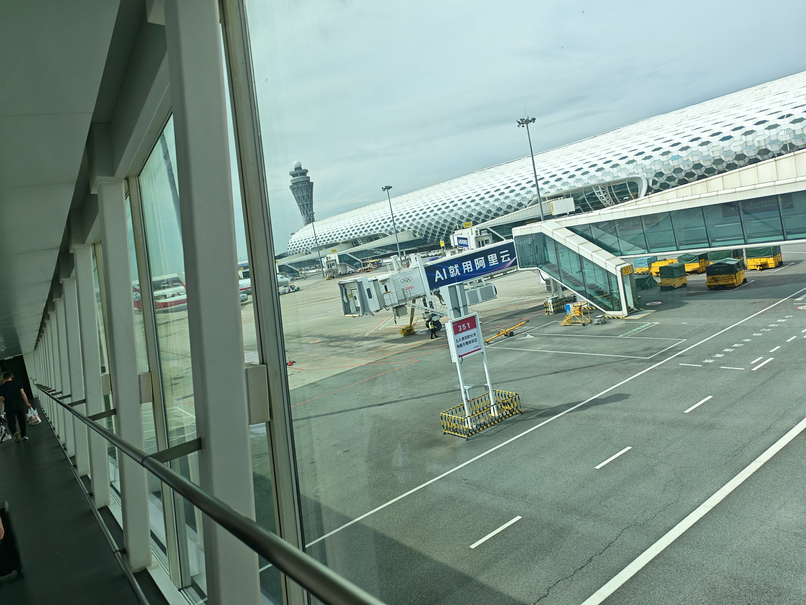

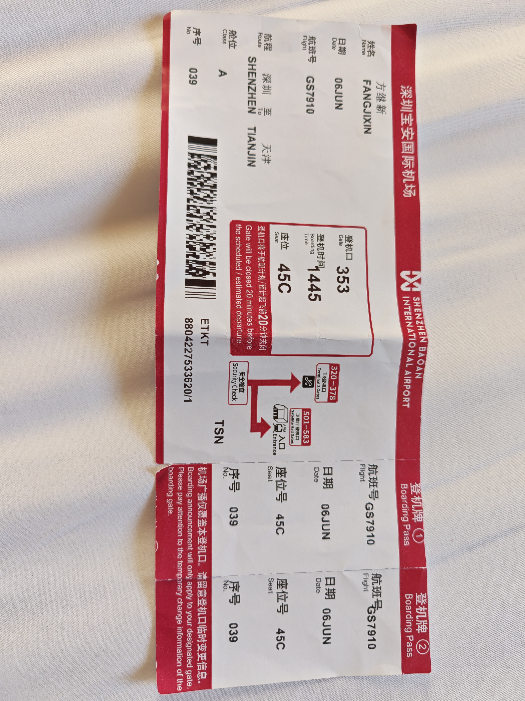

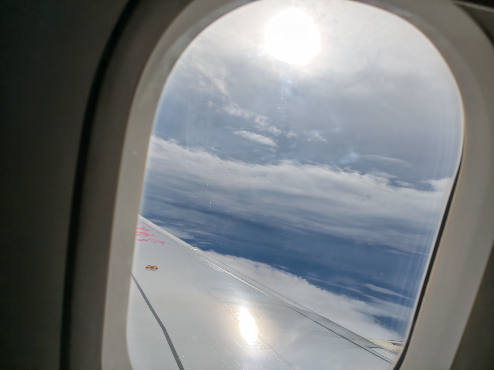

### 20:00 出发

靠窗的两位乘客由于需要转机，且时间间隔较短，去了前排，我来到窗前拍下了一组黄昏边界

### 20:30 天津

天津，你好

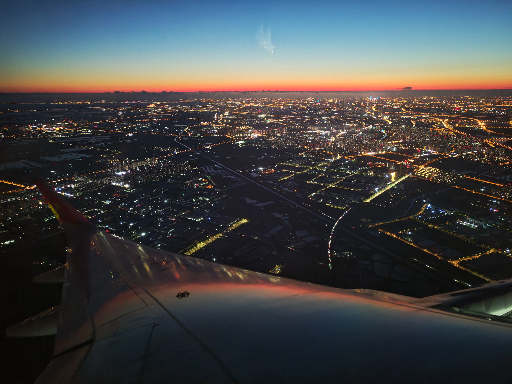

### 21:50 彩虹小镇

从机场出来，就有一堆人在询问小伙子要去哪儿打的吗？我就说要去彩虹小镇，但是我就要求他提出来要多少钱，他说按照打表计价，但是我需要一个大概的价格，他就是不说，等到走出一段路后，他才说要60，我直接拒绝了，他还骂了我一句，我都无语了，呜呜。然后我在高德地图上点了一个打车，结果我上车后报了我的手机号司机却说不对，我就奇怪了我高德地图的车牌号就是这个车啊，结果把司机弄烦了，结果我检查高德绑定的手机号才发现用的是我已经注销了的手机号，好尴尬。

走在彩虹小镇的街道上，一个感觉是好冷哇，有的地方好黑。 
怎么那么多足疗店。。。
彩虹小镇就是一个火祸烧烤大杂烩啊，一直以为是什么大型商场
麻辣香锅，铁锅炖，云南过桥米线，东北麻辣烫，黄烟鸡
我想你之前吃的铁锅就是这个铁锅店吧，来一份士鸡锅尝一尝。干万别点土鸡锅，肉好柴，啥也没吃到，也可能是我胃口太小了吧。 

### 02:00  彩虹小镇

晚安

不得不接受你的离开，呜呜呜

# 20260607 关于我们

### 5:00 彩虹小镇

早安，睡不着，起床去走走
彩虹小镇还有个库迪咖啡，建在二楼，迅有一个轰趴馆梧桐语，不知道里面有啥.。

### 6:00 彩虹小镇

找到了第二家花店，也是关着门，应该还是太早了吧。不过路过一位阿姨看到了我站在店门口应该是来买花的，帮我联系到了店主，看到了一簇白桔梗，正是我想买的花，便挑选了两只，抱歉，没有选择一簇花去见你，怕你有太大的压力。不知道这样做对不对。 

### 7:00 忐忑

我选择走到学校去，不知道能不能进去看看呢。

这条路绿化做的真好，阳光透过树叶照在这条小道上。

第一次穿增高鞋，哎哟，我的脚好痛，这才走一半呢。

### 关于我的沉默1

我的沉默是从什么时候开始已经记不清了，从小学开始就有了？初中呢？初中是肯定有的，原因却无从知晓了，那时候起慢慢的就变成一个人了。

### 8:40 学校

终于到了，能进去吗？ 
准备若无其事地走进去，就被拦住了，呜呜呜，为什么不让我进去
外面逛一圈吧。

如果她知道我来这里了，会是什么感觉呢？ 

欣喜吗，我不知道
会害怕吗，曾经的恐惧竟然找上门来
会委屈吗，怎么现在才来看你
还是只是一声叹息

学校只有一个大门啊，我还想着翻进去呢，被门卫认出来了到时候我怎么出去，呜呜呜

### 9:30 学校

学校正门口左侧柳树下席地而坐，柳絮随风起，思绪杂乱无章

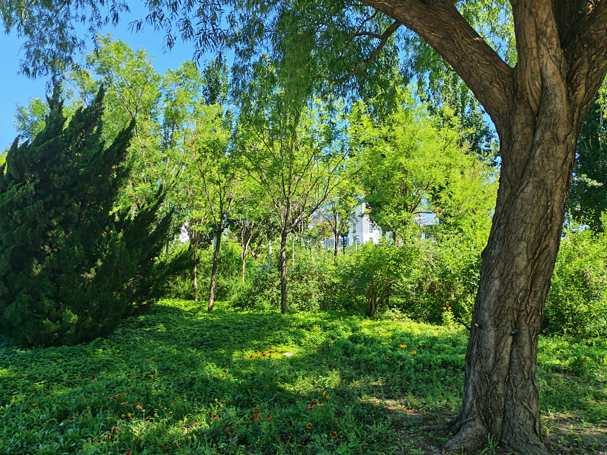

### 10:00 我好想你

### 关于她的爱1

你是爱我的，给了我这么多次机会，忍受了我这么多次委屈，依旧在我身边，谢谢你。只是现在呜呜呜，对不起。

### 关于回应

你很需要回应

包括你说的消息秒回，电话秒接， 争吵不能沉默冷暴力，要按时报备，对不起，我理解错了。 
这些其实都是你内心的不安，我有责任和义务做到这些事情。

我太沉默了以及我的回应对你来说很仓白

### 关于争吵

每次吵架我都想要赶紧结束，我接不住你的情绪，每次看到你痛苦的时候我更多的是难受，不是因为讨厌你， 而是因为你难受所以我难受，因为我不知道如何回应你而难受，我只想要它赶紧结束，或许第二天就好了，但其实这是我在逃避，就是你所说的忽视你的感受吧，直到现在我依然在想到底该如何处理它，我只能说我在，我一直都在。
还有更多的争吵其实是关于我的。我之前一直对你冷暴力而不自知，后来不冷暴力了，但每次净吵却变成了我也跟着吵，非得争个理所应当，看不到你的诉求，你要的安全感，感受不到你的委屈。拿上次洛克王国的事来说其实你只是感受到了我游戏里忽视了你让你生气难受，我却非得一直强调自己就是没看见，很对不起。
如何能接住你的情绪呢，每次争吵其实背后都是你的情感诉求，我坚决不能再去争什么输赢了，因为人才是最重要的.。可到底应该如何做呢？首先坚决不能逃跑，然后不能抬杠，最后还是需要一点学习，争吵的时候我感觉好无能啊，为什么我是这样的人。

### 关于忽视

争吵却不解决问题是忽视，我只想着赶紧结束就好了，但是她的内心的痛苦和委屈却在不断积累。 

### 关于她的爱2 

争吵也是因为她在乎我对她的感受让她难受和委屈

### 关于我的改变

我的改变不仅仅是说不在冷暴力，知道报备。不冷暴力不是变成跟着一起吵。报备不是机械地下班，洗澡了。分享一下今天的心情，有意义的事情，可是我的生活好枯燥。我没有可以分享的生活。

还有一些难以改变的事情，我的沉默深根蒂固，我的低情商令人发指，她说她无法承受这些带给她的泪水。我却只能无力地看着

还有一个，关于主动，我的主动坚持不了多久，我一直是一个被动的人，当初的入室抢劫让我愈到很幸运，但我却抓不住。谢谢你能来过。我该怎么办了呢？

### 关于她的智慧1

她可以敏锐感受到我是否爱她，她说我有能力爱她，但是我为什么似乎忘记了，我好难受

她能感觉到她自己各种各样的情绪，不开心，难过，恐慌，期待，快乐

我好想她

她的记忆力真的太好了，我一直都说她是一个聪明的女孩子，没有几个人能比得上她的聪明才智，我是认真的。

### 关于冲动

我好想告诉她我好想她，但她需要的是我的不打扰，她无法释怀的痛苦，她拒绝与我联系，害怕再次受伤害。 
我很慌，我害怕失去你，我已经失去你了呜呜。

### 关于失诺

我的"好好珍惜"是个空头的念头，矛盾发生时依然被"我很无能无力"瞬间压倒。
我的"争吵前动动脑了"也是作样子，一吵起来唉就丧失了。
我的"以前热情到现在冷谈"，我一直以为我们在一起就很好了，是我松懈了，对不起。

### 关于一些丝丝打扰

我知道我现在不应该打扰你，我以前总以为我们能一直在一起就很好，忽略了你真正需要是回应和安全感，我以前说过的那伤害你的话是我这辈子了最愚蠢的错误，我没有办法为你遭受到的痛苦辩解，我也从来没有看不起你，更不敢有看不起你的想法，我才是那个应该被看不起的人。

我现在非常非常想念你，我知道这份想念对你来说可能没啥价值，甚至可能让你感到压力，失去你我真的是很慌乱。对不起，没能好好珍惜你，你是一个值得好好爱护的女孩，而我一直在犯错。

还有这是一份断断续续更新的日记，后续会将这些重新思考写上去https://meeniar.github.io. 
呜呜呜不好意思，祝你幸福平安。

还有你不是说可以考虑不拉黑我吗？不要拉黑我，其实每次拉黑我都很难受，但是其实你才是更难受的那个人吧，对不起。我话很少的，不要拉黑我。不要哇，再给我一点点机会吧，让我做什么我都愿意的，你太重要了，我丢不起。

（一些碎碎念，我还需要反思，你可以当做没看见🥹）

### 13:23 见面

起身，该去见一见你了，从学校再走到彩虹小镇，我的脚好痛啊，只是肉体上的疼痛罢了。

### 15:05

抱歉，迟到了五分钟

抱歉，没带上你最爱喝的霸王茶姬，但是旁边有沪上阿姨，点一杯少糖的杨枝甘露吧

场景：

亲爱的她，我买到了明天的机票

我知道我们从来没见过面，我也知道你现在肯定特别不想见到我，更不想再和我有什么任何关系，我这次来，不是逼你见面，也不是要纠缠你或者求得你的原谅，我只是觉得，让你受了那么多的痛苦和委屈，需要当面道歉，对不起。

我不会去你学校门口，我就在彩虹小镇商业广场的肯德基里等你，从15:00到17:00，我道完歉立马就走，绝对不会纠缠你不放

如果这么做还是让你觉得心有压力的话，请当做没看到这条消息，我也没来过这里

对不起，之前那么多次争吵，我都回避掉了你的感受而不自知，让你受尽了委屈和痛苦，包括那些伤害你的话，这都不是你应该承受的，我无法想象你常常携带着痛苦入睡甚至惊醒，这都是我得错。

我知道现在说什么都已经晚了，我没有一丝脸面去求你原谅我，就像你说的，我没法放过自己才是合理的

打扰你了，愿你能尽早忘记痛苦，遇见真正的幸福和快乐。

### 关于累

她说她累了
她说你明明是知道怎么爱人的但却对她视而不见，吵那么久一点软都不服，哄也不哄，她累了。
我当时的心里想法是什么呢？以上她说的话是发生争吵后她说出的话，总是事后才体会到她的幸酸，她也只是想我能好好重视她的感受啊，结果我呢，以为她又在责备我了，我一看到又要吵架，选择了最自私的回避， 我不仅没有哄她，还为了掩饰自己的无能去争执。 就这样一次次地消耗你，让你倍感心累吧。 

这难道不是变成了另一种暴力。
询问ai：
改不了回避的无力和痛苦是什么: 
我口中的改不了，其实是我在为自己的懦弱和自私找借口， 从你说绝望的那一刻，我还在悲观地想我就是这刻在骨子改不掉的人。

回避的本质：掩饰自己的无能，封锁自己的脆弱

​	当面对情绪压力时，我得“害怕不知道怎么哄”“害怕做不好”“害怕失败”的念头会带来巨大的羞耻和无能，而自己承认无能和脆弱比死还难受，潜意识开始沉默回避。如果当时我能说出我的感受，哪怕再怎么羞耻，我想你也是开心的吧，可我却

从沉默到吵架：无能引发的另一种暴力

​	沉默是冷暴力，当沉默的遮羞布被撕扯，为防御开始使用吵架来反击，这更伤害了她的心吧，对不起。

### 关于矛盾

她不要再受到伤害和恐惧，她已经受到严重的伤害了，而这些都不是她应该承受的。

### 23:15 思念

我想把这些碎碎念都写完并用邮箱发送给你，才发现不知道什么时候已经又被拉黑了，对不起，我好想你呀。

# 20260609 离别

### 7:00 

起床，请了一天假
今天是周一，应该是第十五周，实训课，又是早八的一天，辛酸的宝.。
我这就过去，哎呦，我的老脚好痛哇。

### 关于见面

很抱歉，没有在2026年提过五一见面的想法让你又感到失望了，之前听你说四月和暑假都有安排了，我自以为你暂时还没准备好见我，唉，我当时多提一句就好了，其实你是需要我提出关注你的想法的，我老是心底里想着等等就等等，结果等来了遗憾，不知道这辈子还能不能再相遇。

我得加快脚步了，过去应该差不多8:30。

### 关于离开

你说你调解不好那段经历，你说你需要冷静一下。我却无法用任何语言去安慰你，想着你是不是又要解决我了我便先提础了出来，但这在你眼里可能意味着放弃，这个选择权应该在你，而我这样说一定是又伤害了你的心吧。

### 关于敞开的痛苦

你时常说，你无法接受爱的人说出这么恶毒的话， 我常常回以对不起，打我一拳，让我做什么都可以的话， 到最后分开时你说我们的矛盾早已存在，只是我不愿意面对。
我想起之前当你说你所有的话语已经对别人讲完了对我什么话也不想分享了的时候，我十分难受，却又假装不在意，你一定很希望我在意的吧。我却不敢面对你对我的不满和委屈，这又何尝不是你自己的痛苦呢，我理应与你一起。

### 关于悲伤

都说人在极度悲伤的情况下，对什么都提不起兴趣，也没什么胃口，三天里就点了几个鸡块，走了这么多路也不会觉得饿，有时候肚子叫两下就自己停了。我感觉自己不是极度悲伤或痛苦，而是一种恍惚。 

### 关于听话

直到你说我们结束了，我也没有听你的话。抱歉

### 8.20

我到了，依旧在这颗柳树下席地而坐。又重新反思了上面的问题，我不知道自己是否正确。

### 关于在乎

你说可不可以多在乎你一点，我当时听不懂这是什么意思，假装又要回避过去，我害怕你又要说我了。

我听不懂什么叫多在意你一点，很多时候我只能听得懂具体的事情，比如让我安个插件。你要的不是什么完成任务，而是一种被挂在心上的确定感，而我却还一片茫然，想着不是每天报备了吗，你让我做的事情我也不会推辞，自己满心委屈，却完全忽视了你的不安和委屈，对不起。

### 10.51

我突然意识到我的短信是不是也没发送出去，呜呜呜，我真的好想你

### 关于哄

这也是一个一直以来我都在逃避的问题，我不会的东西太多了，没想着怎么解决问题，哪怕笨拙地缓解问题，也比我争吵要强得多得多吧

对不起，是我不好，让你难受了

我知道你现在很生气，我听你说

对不起，我刚刚语气不太好，我知道你是想让我多陪陪你

### 关于回应2

人机回复

突然又想起来了之前你说的不想再跟我分享任何事情了，是因为我的人机式地回复会消耗你的热情

1感受，我回来了，宝宝今天上的什么课呢，有没有吃饭呀

2先处理情绪再处理事情

3用我的真实感受代替沉默，沉默是原罪

### 关于她的感受

她的每一次争吵都是她的不安，都是她确认我是不是还爱她。我问我自己我不爱他吗，怎么可能不爱她啊，但是既然爱她为什么又要伤害她呢？

她失望至极却仍然相信那个以前爱她的我，她给的一次又一次的机会不是因为傻，而是在赌那个可能回头的我，而如今我都做了什么啊

她是在承受多大的痛苦啊，而这一切的根源都是来自于我，我不是人。

抱歉，说了一万次对不起，却没能真正站在你的立场，对不起。

柳絮随风起，桔梗送与你。

### 15.13 再见

再见啦，我的老腿噢，好痛

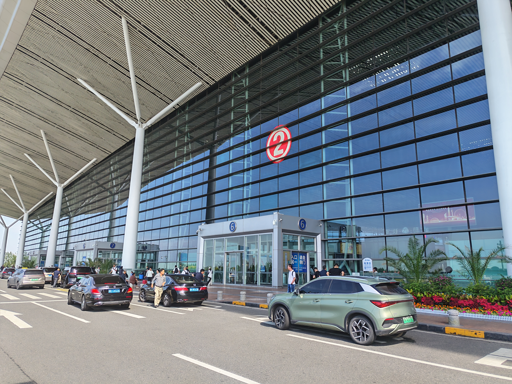

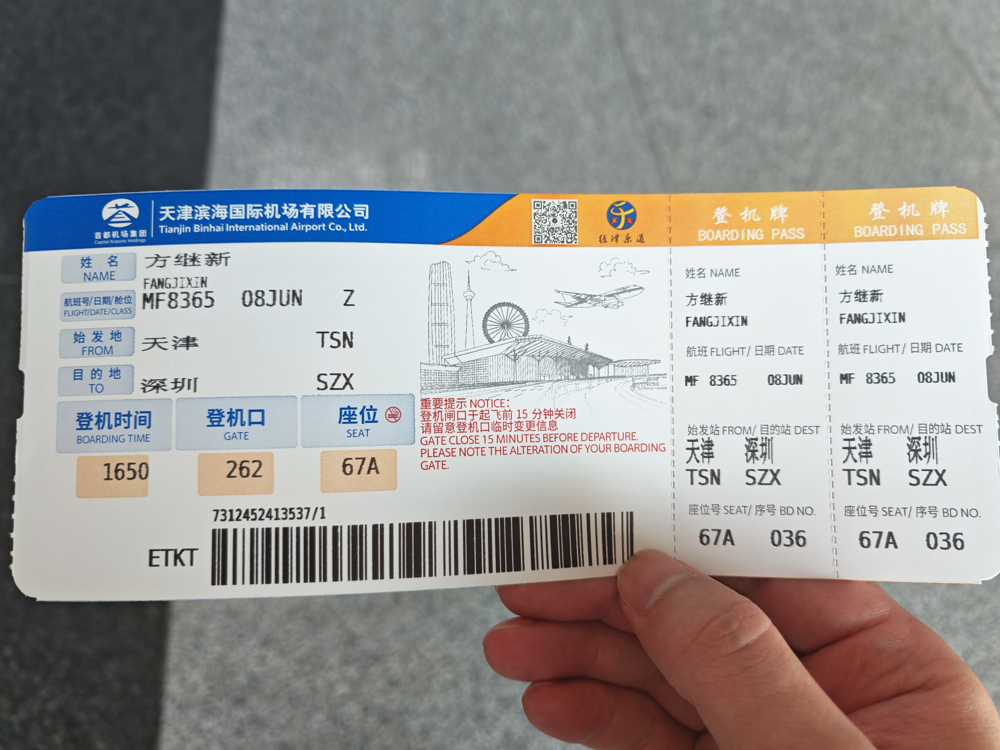

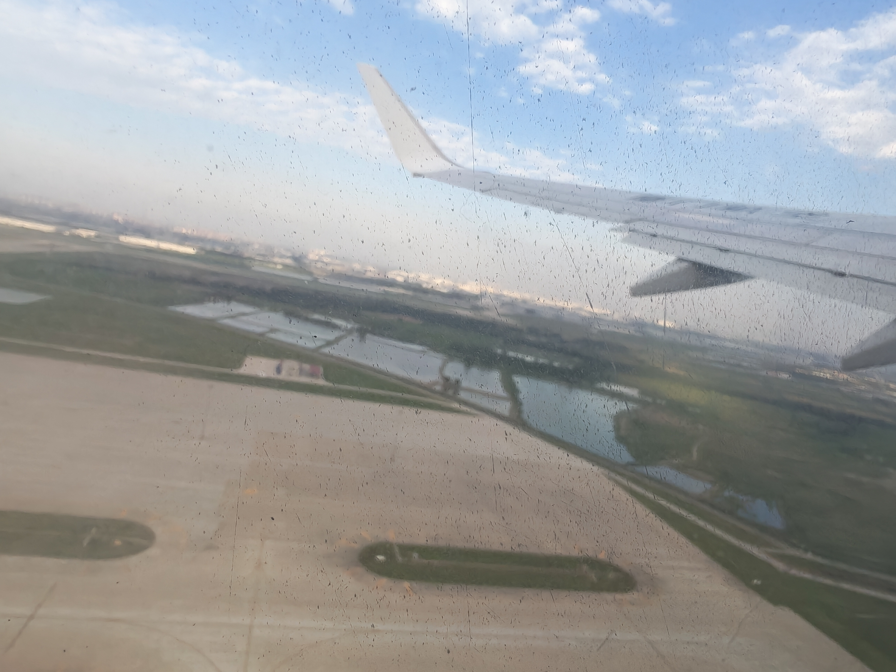

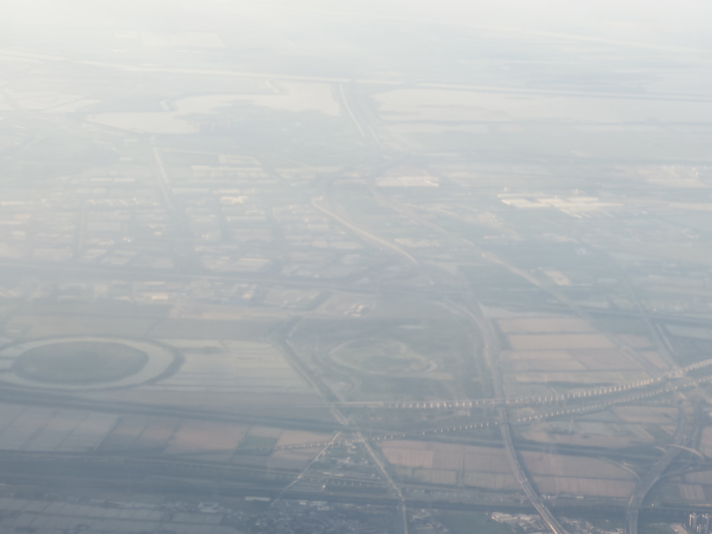

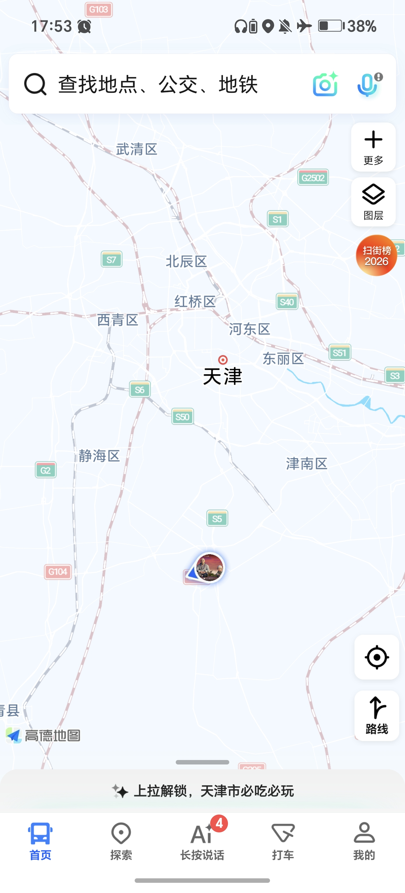

### 17.02 知行合一

要离开了嘛，我好难受
没想到在回去的飞机上崩溃了

我如果知道，我不该去打扰她
我如果不知道，纠缠就是不体面了，我宁可不体面，唉

她很痛苦，她选择了离开，她知行合一，她的智慧比我高得多。

### 21.45 回到深圳

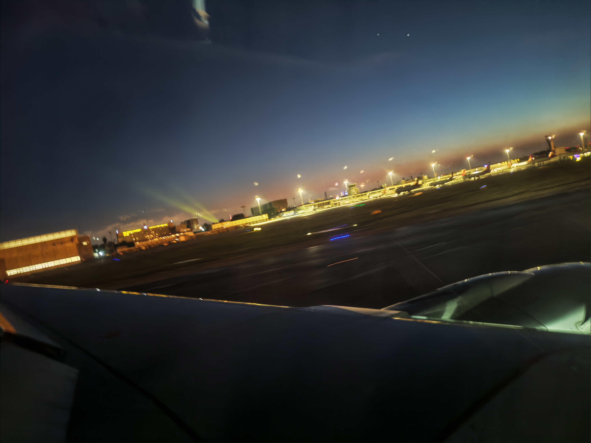

 我的腿炸了，指甲嵌在肉里了，膝盖也好痛，一步一步好狼狈啊

# 20260609 不要你离开

无数次的想念， 无数次想对你说不想你离开，无数次的崩溃，我无法接受你的离开，我不得不接受你已经离开

