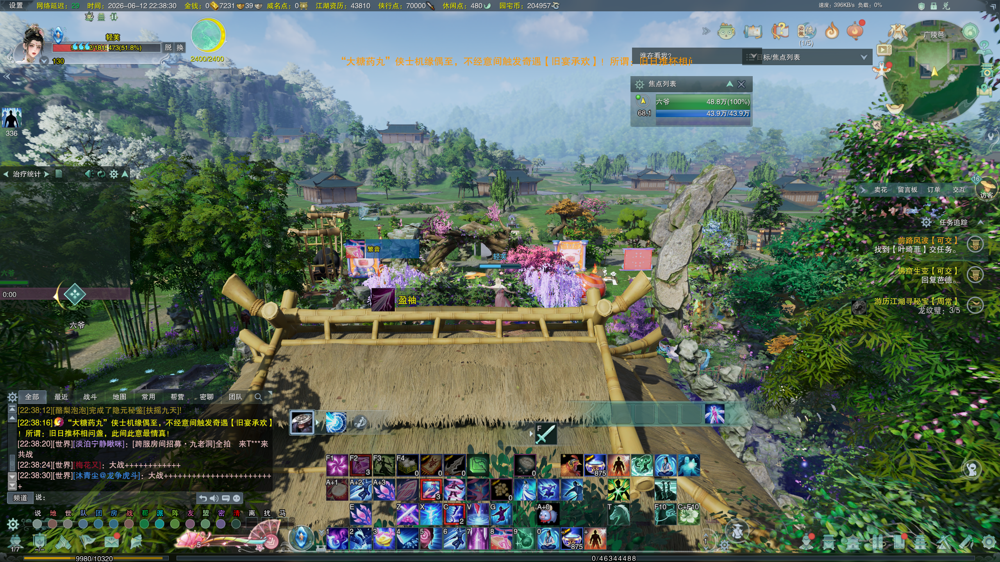
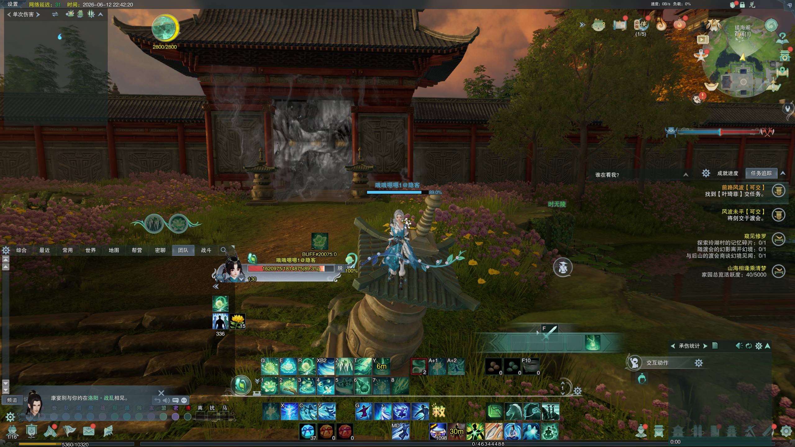
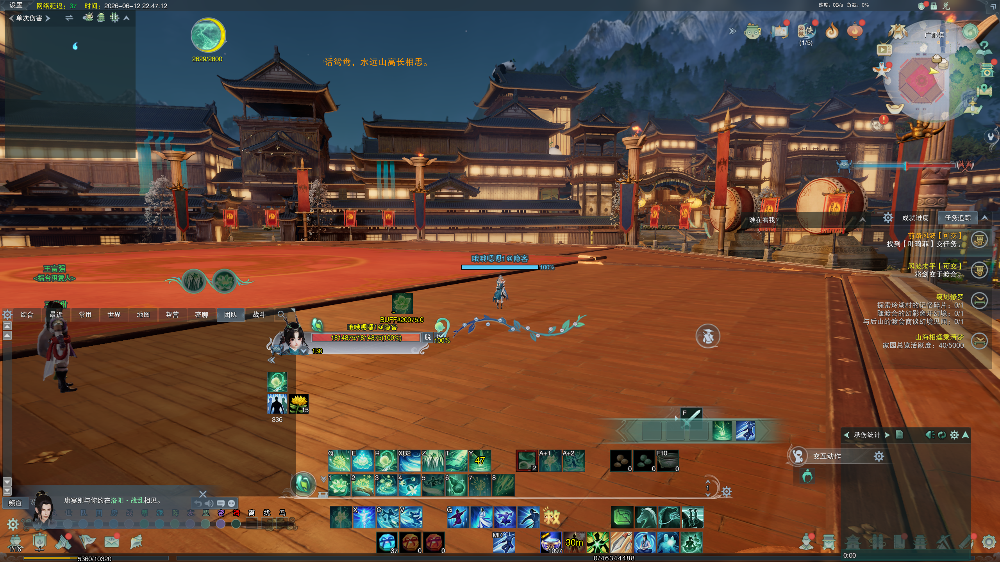

# 20260610

今天上班一整天猛猛干，改了好多代码，一停下来满脑子全是你，我好难受，可不可以不要拉黑我，我需要你。

宝宝是不是把我的电话短信也拉黑了，我好想你呀，不知道你现在怎么样了，可不可以看我一眼。

# 20260611

7：30

今天天气真不错，是一个徒步的好日子，可是我是上班族啊上班族。

走在路上，想起昨晚对你的打扰，唉，我知道不该打扰你，但是我真的忍不住， 抱歉，是不是又戳到了你内心痛苦的一面，当初的你一定也很煎熬吧，对不起。

13:10

我快撑不住了，能不能给我留一点念想

14:13

对不起，我好难受，我好想去跟你诉说，我想当初的你也一样很难受吧

看到了她的短信回复。我崩溃了

# 20260612 周五

我为什么要选择不体面的方式呢，究竟原因还是我的自私。

我想我很愧疚，很亏欠，其实回过头看只是为了可以继续享受有她存在的日子。

那她呢，她所承受的一切，留的泪水呢，你不能再忽视她的感受了，祝她一切安好。

如果还有未来，你应该以一个能够为她付出的人出现在她面前，而不是现在这个自私自利只会伤害的人。

总是要无穷无尽地刷着视频，害怕一停下来就忍不住想她，找她。想来想去，很难过，为什么得到的时候不知道珍惜，现在却后悔莫及。

22:36

删掉了电脑上很多游戏。又看到还存在剑网3，于是便更新一下，看看曾经走过的地方

遇见你，很幸运，谢谢你给我生命中带来了一抹色彩。

现在成都里也很冷清了呢，又有点想你了。

# 20260613 情感漠视

## 16:01 情感漠视

如何判断情感漠视：

+ 对你的情绪完全“无感”
+ 刻意回避深度沟通与矛盾
+ 只索取情绪，从不付出

亲密关系中：

+ 很少主动表达在意、想念、偏爱、仪式感，情绪安抚几乎为零
+ 无法理解感受和需求
+ 吵架从来不反思问题的根源
+ 对待情绪，态度冷漠，仅做表面应对
+ 遇事只讲道理，不讲感受，遇见矛盾第一时间是逃避而不是沟通

情感漠视的改变：

+ 局限：多年形成的思维和行为惯性，很难彻底变成热情、共情力强的人，顶多做到 “合格回应”，做不到主动提供情绪价值
+ 改变方向：尊重他人情绪、不否定他人、愿意直面矛盾、停止冷战
+ 关键前提：本人清晰意识到自己的问题，发自内心想调整，愿意花时间学习沟通、共情。

改变条件：

+ **自我觉醒**
  + 察觉到冷漠伤害了关系、伤害了你，发自内心想改变
+ **持续行动**，而非口头承诺
  + 长期行为：愿意主动询问状态、矛盾时不逃避冷战、不再否定情绪、学着换位思考
+ **有耐心复盘、调整**
  + 几十年的性格 / 思维惯性，不可能几周就扭转。过程中一定会反复，需要有耐心复盘、调整，而不是一受挫就放弃

离开：

+ 你永远无法改变一个不想改变的人
+ 别做漫长且无望的救赎者

她说：你明明知道只要爱我一点点，我就可以。。。我却还在逃避。

## 16:35 离开 复盘2026-05-22

2026-05-22 17:22

    
芙
 
    
 一聊到分手这事儿我就开始暴饮暴食 
 

2026-05-22 17:33

 
方
 
 
    别暴饮暴食啊哥【幽灵】

反思：此时，她一定面临着很痛苦的精神压力吧，而我却回复了一个不要暴饮暴食的话，她需要的是情感上的共情和安抚，而不是我这干巴巴的敷衍。

 
芙
 
 唉很难讲我还爱不爱你 
 

2026-05-22 17:54

 
芙
 
 
    好想分手 
    过不下去了 
    
 

2026-05-22 18:13

 
方
 
 
    好

 
芙
 
 
    你根本 
    就不在乎我啊 
    我擦嘞
    
 

 
方
 
 
    我要说别分吗，唉，我不想看你这么痛苦，我想分吗

 
芙
 
 
    你根本就不在乎啊大哥哥
    
 

反思：她说的是想分手，是在给我最后一次机会挽留她，而我却好像是在对她说赶紧离开。我当时看似是在为她着想，实际上这是对她道德绑架，利用她的痛苦，作为自己逃避责任、不付出情感的借口。她都说不在乎了，我却没有勇气面对自己的内心，还将她狠狠丢弃。

2026-05-22 18:18

 
方
 
 
    话都让你说完了，你一直说要分手，我能捆住你吗

2026-05-22 18:21

 
芙
 
 
   	   6 
       你一边说哎呀其实我也不想分 
       然后一边衬得我像是个坏人 
       6 
    
 

 
方
 
 
    我说过一次分手没有？

反思：

她的感受：【极度的荒谬感、委屈与愤怒】明明她才是受伤害最深的那个人，需要我的共情和安慰，而我却是一副受害人姿态，这个6一定是生气到极致了吧，无语，心寒，她看穿了我既想逃避，又不想承担坏人罪名的虚伪，让她崩溃。

我的感受：【强烈的防御、委屈与“抓字眼”的理智脑】当听到她说我不在乎她，说想分手时，我的防御机制瞬间激活，刚刚下班，心底里升出一种扭曲的委屈：分明是你每天在闹，天天说要分，我明明什么都没说，为什么还要怪我？于是我的理智开始抓字眼（我没说过分手），试图从逻辑上的事实掩饰我态度上的冷漠（一直在逼你走），拒绝承认自己冷漠

 
芙
 
 
   	   你哪次不是让我提？ 
       之前冷暴力我逼着我提分手 
    
 

 
方
 
 
    没逼你提啊，你又这样觉得

 
芙
 
 
   	   那你之前冷暴力我是干什么，喜欢冷暴力吗？
    
 

 
方
 
 
    我就是这样的死人啊

 
芙
 
 
   	   那不是我应该承受的吧，，
    
 

2026-05-22 18:30

 
方
 
 
    嗯

反思：

她的感受：【绝望、被拒绝沟通的窒息感、尊严被践踏】冷暴力是她内心深深的伤口，她问我为什么要这样折磨她，可她换来的是什么？“我就是这样的死人啊”。

这句话对她而言是一次**极其残忍的情感处决**。我连掩饰都不掩饰了，她只会感受到深深的绝望：“你宁可承认自己是一个死人，也不愿意为我做出一点点改变”。

我的感受：【摆烂、无能为力到极致的自毁、心理罢工】此时的我已经完全放弃了抵抗，当她指控我冷暴力时，我内心的愧疚，无能为力，挫败感彻底爆发。我没法解释，因为她说的都是真的，但我又没能力去改变，我不知道如何成为一个“热烈的人”。在巨大的精神高压下，我选择了最极端的自保方式——摆烂和自黑。“我就是个死人，你满意了吧”，我用自毁的语言为自己筑起无赖的高墙，看似是在骂自己，实际上是在潜意识里对她吼叫：“我就是这个样子，你别再逼我了”

 
芙
 
 
   	   	   然后现在又来说 
       	   哎呀我没逼你提~ 
       	   ？这到底是干啥啊。。 
    
 

2026-05-22 18:54

 
方
 
 
    我也不知道说什么，下班了【幽灵表情】

2026-05-22 21:57

 
方
 
 
    我回来了【幽灵表情】

反思：

她的感受：【被彻底遗弃的寒冷、漫长深夜的自我凌迟】长达三个小时的时间里，我用一句下班了，回来了的话把我们之间关乎生死存亡的感情降格成了打卡下班的例行公事，但这三个小时来对她一定是**致命的煎熬**吧

我的感受：【鸵鸟心态、松了一口气、虚假的平静】发出“下班了”的那一刻，我终于找到了一个绝对正当的借口名正言顺逃离这个充满压力、指责的对话环境。“我回来了”，也只是一种试探，试图用日常的、无事的语气来粉饰太平。

2026-05-22 22:57

 
芙
 
 
   	 唉分手吧 你一点都没有想挽回我
    
 

反思：

她的感受：【哀莫大于心死，平静的放弃】经过了一整晚时间的等待、内耗、崩溃到最终的死寂，唉，她终于接受了一个事实，他真的不爱她，也不会挽回我。

她的心已经彻底冷透了。这句分手，是她在看清现实后，为了给自己留最后一点尊严，做出的最沉痛，也最决绝的割席。

我的感受：【沉重的麻木】看到这句话，我没有哭泣，而是一种深不见底的麻木和空洞，我去洗澡，总是忘记这个忘记那个，脑子一片空白，潜意识里甚至有一种宿命论的自嘲。我用这种麻木，再次把自己保护了起来，拒绝去感受那个在深夜彻底失去她的惊恐。

整个场景，都是她在确定“你爱不爱我，要不要我”的态度；而我永远都是“我很累，我没办法”的逃避和自保。我没有逼她分手，但我用一次次的沉默，摆烂，逃避把一个满眼都是我的女孩，逼进了一条除了提分手、否则就会被冷死在里面的绝路。

问：我明明应该感到痛苦流泪，为什么却仍然表现得像是一个局外人？

G：你的思维逻告诉你：一个正常人面对这种局面应该痛哭流涕，应该悲痛欲绝，但你的情绪反馈却是一汪死水。这种认知和情感的巨大割裂，让你觉得自己像个怪物，你害怕真的失去了人的核心共情能力。你不是不痛苦，你只是还没有资格和能力开始痛苦，你的麻木，是你无能为力的最后伪装。

情感隔离：痛苦的体量太大，你承受不住；潜意识为了保护你不会陷入彻底的精神崩溃，直接熔断，将所有的情绪全部封装了起来。

本质上还是自私自利的行为。骂自己不是抵消自己的罪恶感。我应该记住这份耻辱。

22:09

每次行动前花点时间思索是否致良知。对于承受痛苦的生者，我拿什么赎罪。

# 20260614 

21:09

今天也是很想念你的一天，时不时就会升起这样的念头，也不敢再去打扰你，还在幻想着有没有一丝丝可能。不知道你的痛苦是否有所缓解了呢。

今天睡觉的时候也不是很安稳，睡个觉做了三次关于你的梦，已经记不清具体的内容了，有一点点痛苦。

今天学习了关于AI的LangChain工具，也不能叫做学习吧，观看了一遍这个工具的介绍信息，并没有手动记下来详细内容。

还是很想你，唉，对不起
